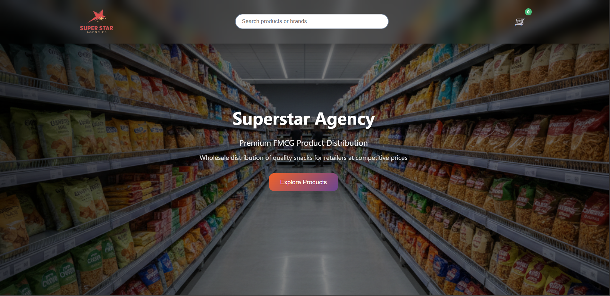
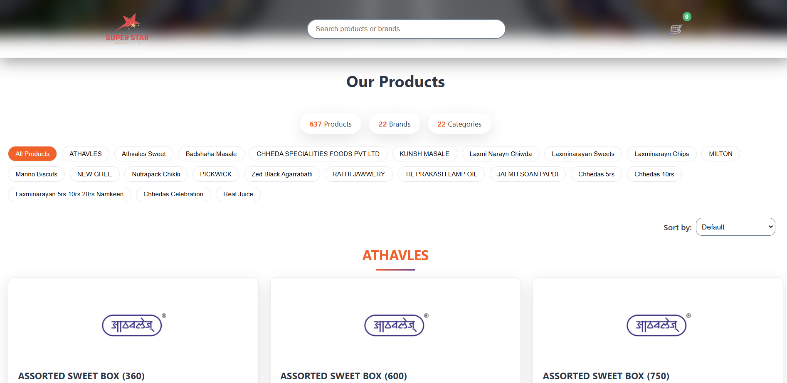
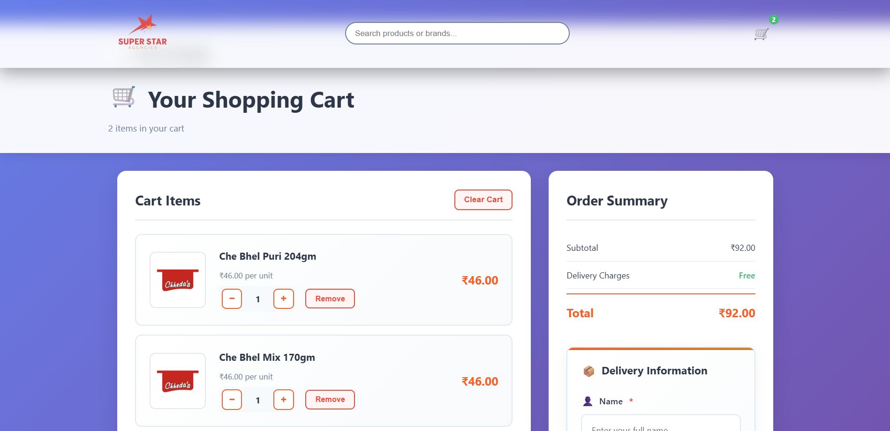
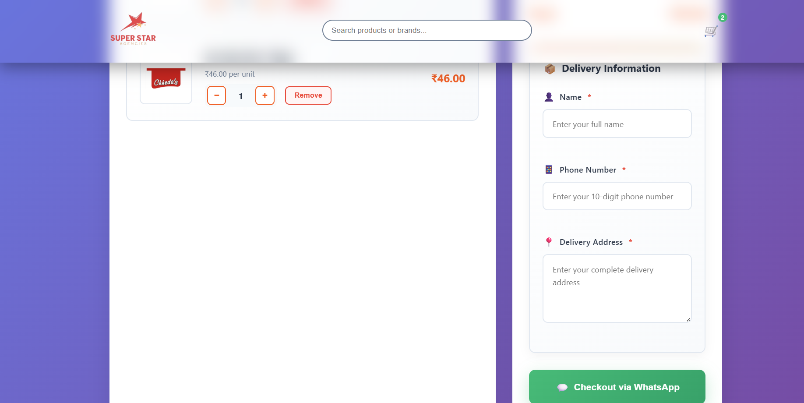
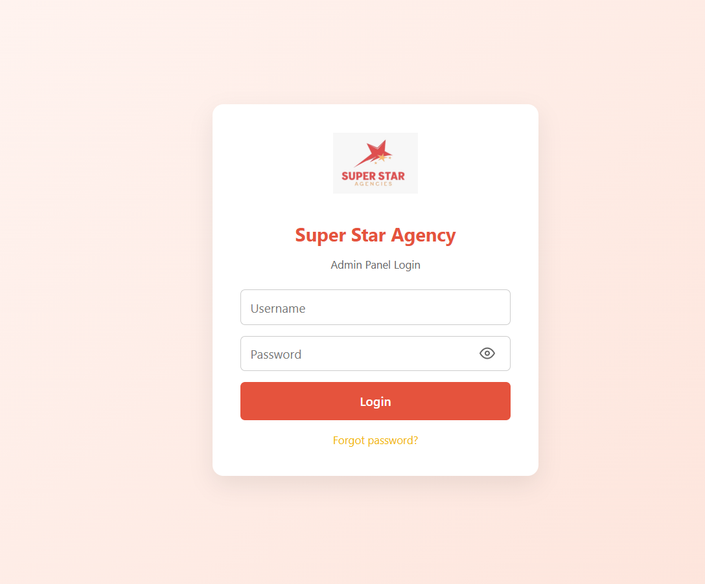
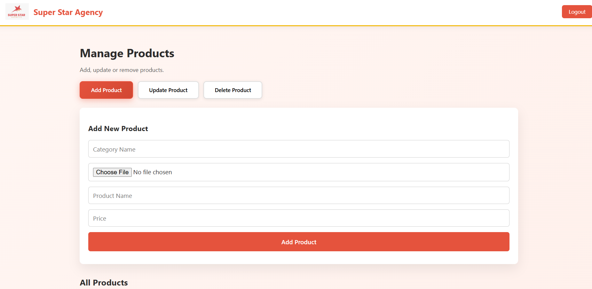

<h1 align="center">🛒 Super Star Agencies – FMCG Distribution Platform</h1>

A modern web-based FMCG product distribution platform designed for wholesalers and retailers to browse products, manage orders, and streamline product management through an integrated admin panel.

## 📌 Overview

Super Star Agencies is a digital FMCG distribution platform designed to help wholesalers showcase and manage their product catalog efficiently.

The platform provides a **customer-facing product browsing system** and an **admin management panel** that allows administrators to add, update, and manage product listings.

Core concepts demonstrated in this project:

• Product catalog management 
• E-commerce style product browsing 
• Category and brand filtering 
• Shopping cart system 
• WhatsApp-based checkout system 
• Admin panel for product management 

The system enables retailers to easily explore FMCG products and place orders directly through WhatsApp.

---

## 🧩 Features

### 🛍 Product Browsing
• Search products or brands 
• Category-based filtering 
• Product listing with pricing 
• Organized product catalog 

### 🛒 Shopping Cart
• Add products to cart 
• Quantity increase/decrease controls 
• Remove items from cart 
• Automatic order summary calculation 

### 📦 Checkout System
• Delivery information form 
• Customer name, phone number, and address input 
• WhatsApp checkout integration for placing orders 

### 🧑‍💼 Admin Panel
• Secure admin login system 
• Add new products 
• Update existing products 
• Delete products 
• Manage product categories 

### 📊 Product Management
• Category-based organization 
• Product pricing management 
• Image upload for product listings 

---

## 🛠 Tech Stack

• Frontend: HTML5, CSS3, JavaScript 
• Backend: Python (Flask) / Server-side API 
• Database: SQLite / Database-based product storage 
• Authentication: Admin login system 
• Tools: VS Code, Git, GitHub 

---

## ⚙️ Setup Instructions

**1️⃣ Clone the Repository**

git clone https://github.com/yourusername/super-star-agencies.git

cd super-star-agencies

**2️⃣ Install Backend Dependencies**

pip install -r requirements.txt

**3️⃣ Run the Backend Server**

python app.py

**4️⃣ Open the Application**

Open your browser and navigate to:

http://localhost:5000

---

## 🖼️ Screenshots

### 🏪 Homepage / Product Landing Page

  

---

### 🛍 Product Catalog Section

  

---

### 🛒 Shopping Cart Page

  

---

### 📦 Checkout & Delivery Information

  

---

### 🔐 Admin Panel Login

  

---

### ⚙️ Admin Product Management

  

---

## 📌 Future Improvements

• Online payment gateway integration 
• Order tracking system 
• Retailer login and dashboard 
• Inventory management system 
• Analytics for product sales 
